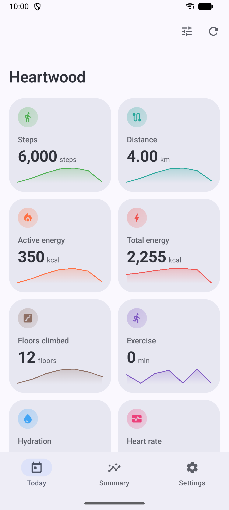
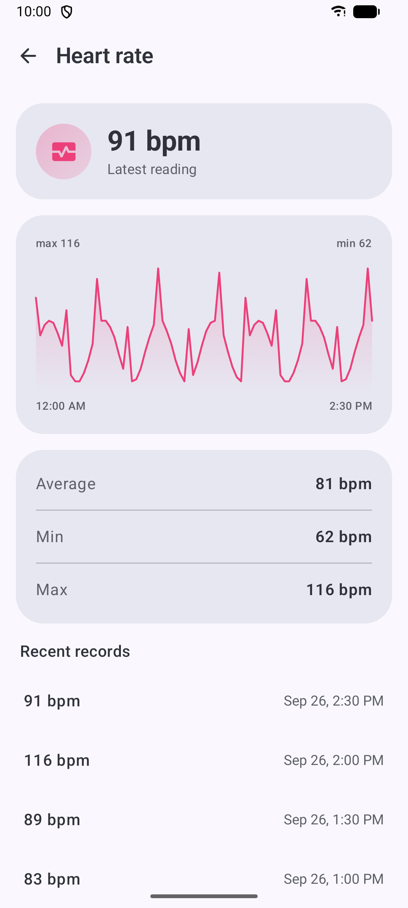
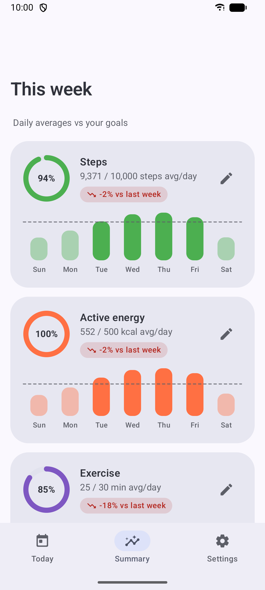
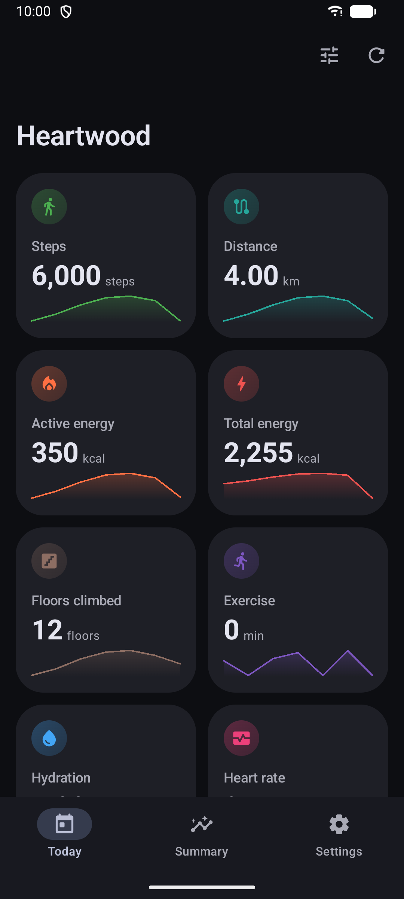
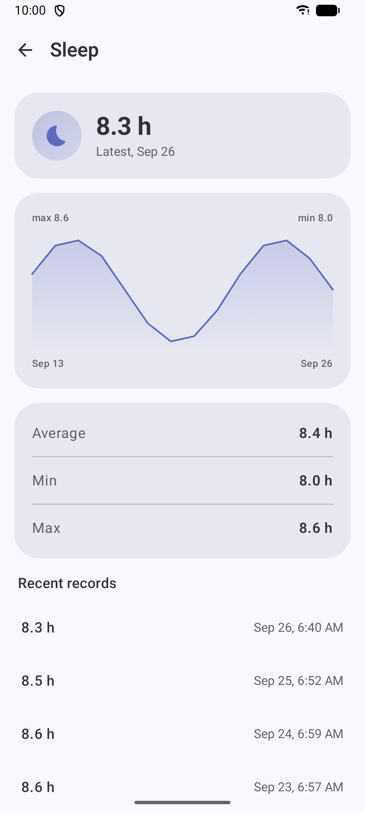
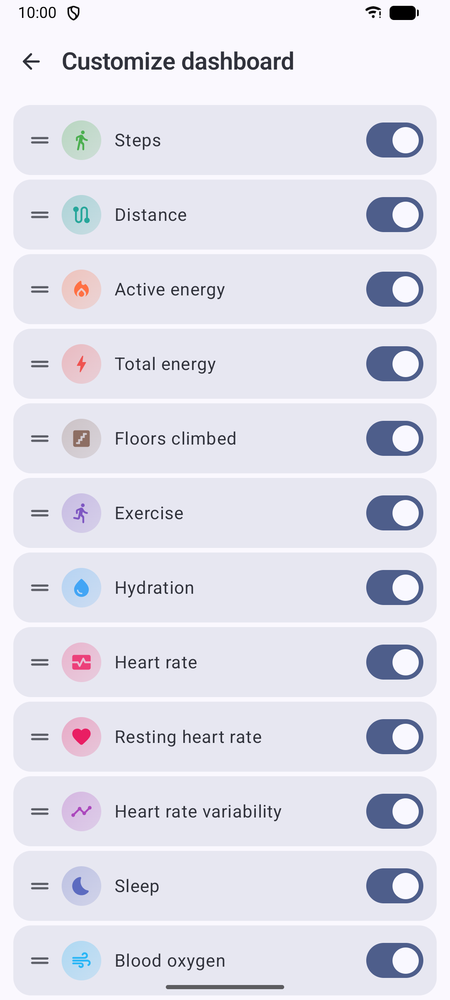
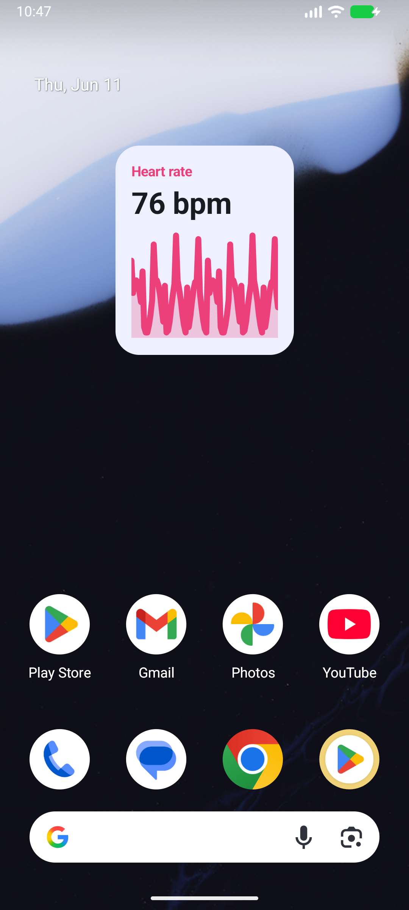

# Heartwood

[](https://github.com/GuyOnWifi/heartwood/actions/workflows/ci.yml)
[](https://github.com/GuyOnWifi/heartwood/releases/latest)
[](LICENSE)


A private, **read-only** [Health Connect](https://developer.android.com/health-connect)
viewer for Android, built with Jetpack Compose and Material You. Heartwood shows the health
and fitness data already on your device, beautifully, and without sending a single byte
anywhere.

> No accounts. No network permission. No trackers. Just your data, on your device.

<p align="center">
  
  
  
  
</p>

## Why Heartwood

Health Connect is where Android keeps health data from your phone, watch, scale and apps, but
Android gives you very little way to actually *look* at it. With Google Fit
[being retired](https://9to5google.com/2026/05/07/google-fit-shut-down-health-replacement-migration-tool-coming/)
in favour of the cloud-backed Google Health app, Heartwood is an offline alternative: let
Gadgetbridge, your watch's app or Android's built-in step counter write to Health Connect, and
read it all here.

## Features

- **Today**, Material You cards for steps, heart rate, sleep, energy, distance, exercise,
  SpO₂, weight, blood pressure and more, each with a sparkline. Reorder or hide cards to keep
  only what you track.
- **Detail views**, full charts, statistics and recent records per metric.
- **Weekly summary**, daily averages vs. goals you set, with progress rings, goal lines and
  week-over-week trends.
- **Home-screen widgets**, key metrics, dynamically themed (Glance + Material 3).
- **Export**, save your accessible data to CSV or JSON via the system file picker.
- **Private by design**, read-only Health Connect permissions and no network permission at
  all, so it *can't* send your data anywhere.

<p align="center">
  
  
  
</p>

## Install

Grab the APK from the [latest release](https://github.com/GuyOnWifi/heartwood/releases/latest),
or add `https://github.com/GuyOnWifi/heartwood` to [Obtainium](https://github.com/ImranR98/Obtainium)
to get updates straight from GitHub releases.

Requires Android 11+ and Health Connect, which is built into Android 14+ and available as
[an app](https://play.google.com/store/apps/details?id=com.google.android.apps.healthdata) on
Android 11–13.

## Tech

- Kotlin, Jetpack Compose, Material 3 (dynamic color)
- `androidx.health.connect:connect-client` for all reads
- `androidx.glance` widgets, WorkManager for periodic refresh
- DataStore for goals
- `minSdk 30`, `targetSdk 36`

## Build

```sh
git clone https://github.com/GuyOnWifi/heartwood
cd heartwood
./gradlew :app:assembleDebug
# APK: app/build/outputs/apk/debug/app-debug.apk
```

Or with Nix (pins the whole toolchain):

```sh
nix develop
./gradlew :app:assembleRelease
```

Requires JDK 17 and the Android SDK (`platforms;android-36`, `build-tools;36.0.0`). The
Gradle wrapper pins everything else. See [docs/REPRODUCIBLE.md](docs/REPRODUCIBLE.md) for the
full reproducible-build toolchain and Nix notes.

### Sample data

Debug builds include a seeder that fills Health Connect with two weeks of realistic data for
every metric, handy for development and screenshots:

```sh
adb shell am start -n dev.easonhuang.heartwood.debug/dev.easonhuang.heartwood.debug.SeedActivity
```

Grant its write permissions first (Health Connect settings → App permissions → Heartwood), or
on Android 14+ with `adb shell pm grant dev.easonhuang.heartwood.debug android.permission.health.WRITE_…`.

### Signing a release (optional)

Create `keystore.properties` (gitignored) or set the matching `HEARTWOOD_*` env vars:

```properties
storeFile=/path/to/release.jks
storePassword=…
keyAlias=…
keyPassword=…
```

Without it, `assembleRelease` produces an unsigned APK, which is fine for F-Droid, since it
signs its own builds.

## CI

- **CI** (`.github/workflows/ci.yml`), builds + lints the debug APK on every push/PR.
- **Release** (`.github/workflows/release.yml`), on a `v*` tag, builds the release APK
  (signed if secrets are present) and attaches it to a GitHub Release.

## F-Droid

Descriptions and changelogs live under `fastlane/metadata/android/en-US/`. A recipe template
for the `fdroiddata` repo is in [docs/fdroid-metadata-template.yml](docs/fdroid-metadata-template.yml).

## Privacy

Heartwood requests only Health Connect **read** permissions, holds no network permission, and
never transmits data. You control which data types it can read from Health Connect at any time.

## License

[GPL-3.0-or-later](LICENSE) © Eason Huang
